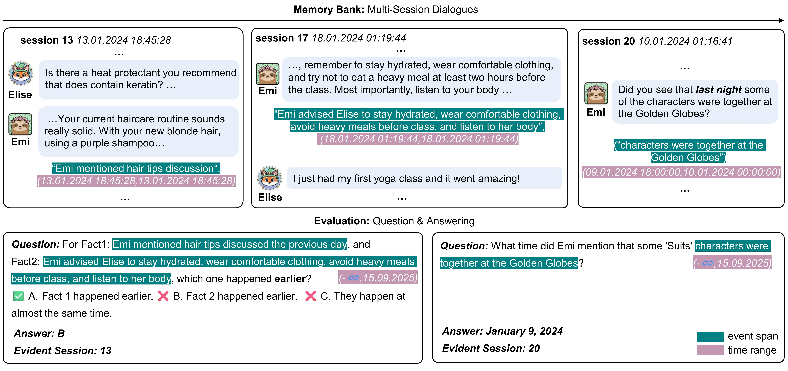
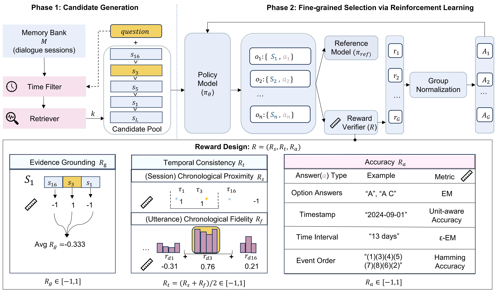
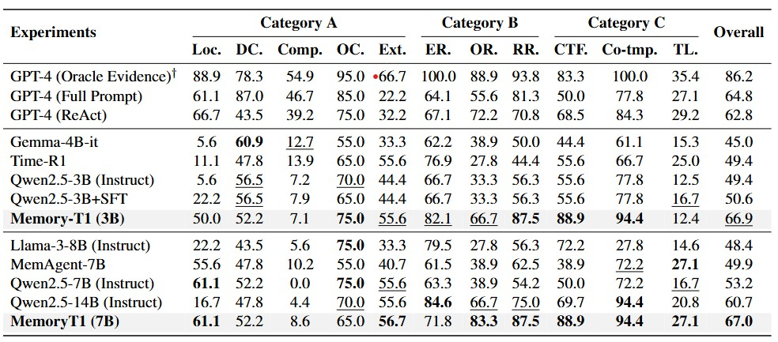
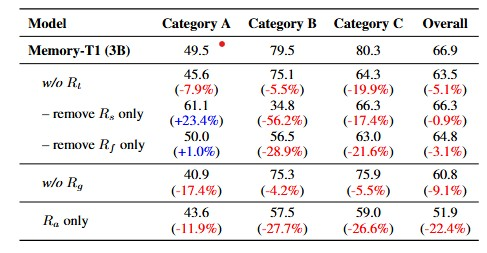
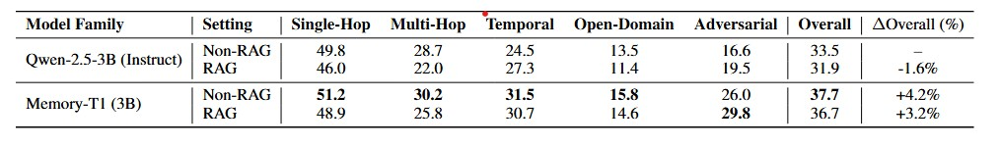

<h1 align="center">Memory-T1: Reinforcement Learning for Temporal Reasoning in Multi-session Agents</h1>

<p align="center">
  <!-- TODO: Replace links -->
  <a href="#"><strong>Paper</strong></a> ·
  <a href="#"><strong>arXiv</strong></a> ·
  <a href="https://huggingface.co/datasets/ElvinDu518/Memory-T1"><strong>Data Page</strong></a> 
</p>

> **TL;DR**  
> \\TODO: maybe shorter. We introduce Memory-T1, a framework that learns a time-aware memory selection policy using reinforcement learning (RL). It employs a coarse-to-fine strategy, first pruning the dialogue history into a candidate set with temporal and retriever filters, followed by an RL agent that selects the precise evidence.**, using a two-phase pipeline: candidate generation (temporal filtering + relevance) → RL fine-tuning for evidence selection and answering.


<div align="center">
  
  <br> Multi-session QA with time-event annotations. Time range marks when an event or query occurs, either a duration or an instantaneous point (start and end coincide). Event span highlights key evidence in the utterance.
</div>

---

## Introduction

- **What is the problem?**  
Existing approaches remain inadequate for temporal reasoning in conversation. A robust, scalable solution for temporal reasoning in dialogue remains an open challenge.

- **What is the key idea?**  
Learn a **temporal-aware evidence policy**: prune candidates efficiently, then use RL agent to select evidence + generate answers.

- **What is the takeaway?**  
MEMORY-T1 improves temporal reasoning and robustness under long, noisy memory compared with naïve “stuff all memory” or simple retrieval baselines.

<div align="center">
  
  <br>
  An overview of Memory-T1. The framework employs a coarse-to-fine cascade to select time-consistent memories for multi-session temporal reasoning.
</div>

---

## Motivation

Why long-memory temporal QA is hard:

- **Long memory ≠ better**: adding more context can introduce irrelevant or misleading turns.
- **Turn time ≠ event time**: the time a user *said* something can differ from the time the event *happened*.
- **Sparse supervision is weak**: answer-only training doesn’t teach *which memory evidence* is correct.

---

## Method

> **TL;DR**  
> Two-phase pipeline: (1) candidate generation to control the action space; (2) RL fine-tuning that selects evidence sessions and produces the final answer.

### Two-Phase Pipeline

- **Phase 1: Candidate Generation.**  
  Use **Temporal Filtering** + **Relevance Filtering** to build a small candidate pool `C` from full memory `M`.

- **Phase 2: Fine-grained Selection via Reinforcement Learning.**  
  The policy outputs:
  - `selected_memory`: a list of chosen session IDs
  - `answer`: the final response  
  Then we optimize the policy with RL using a multi-level reward.

### Reward function optimizing:

- **Answer accuracy**
- **Evidence grounding**
- **Temporal consistency**

---

## Experiments

### Setup

- **Datasets**: Time-Dialog, LoCoMo
- **Backbones**: Qwen2.5-3B, Qwen2.5-7B-Instruct
- **Baselines**: Full Context, Retrieval-Augmented Generation (RAG), Supervised Fine-Tuning (SFT), MemAgent and Time-R1, RL (Task Reward Only) ablation baseline


### Main Results

<div align="center">
  
  <br>
  <em>Performance comparison across different models and training strategies on temporal reasoning subtasks. Category A's metrics include Location (Loc.), Duration Comparison (DC.), Comparison (Comp.), Order Comparison (OC.), and Extraction (Ext.). Category B's metrics covers ER.=Event Reasoning, OR.=Order Reasoning, RR.=Range Reasoning. Category C's metrics comprises CTF.=Contextual Temporal Filtering, Co-tmp.=Co-temporality, TL.=Timeline.</em>
</div>

### Ablations

<div align="center">
  
  <br>
  <em>Ablation study on the reward function of Memory-T1 (3B). Relative changes compared to the full model are shown in parentheses.</em>
</div>

### Model Analysis
Our model demonstrates strong out-of-domain (OOD) generalization on the LoCoMo benchmark.
<div align="center">
  
  <br>
  <em>LoCoMo benchmark: Out-of-Domain evaluation of Qwen-2.5-3B-Instruct and Memory-T1(3B) under RAG and Non-RAG settings. Values are shown as percentages; best results in each column are bolded. ∆Overall shows improvement relative to Qwen-2.5-3B-Instruct (Non-RAG).</em>
</div>

---

## Citation

```bibtex
@inproceedings{...,
  title     = {Memory-T1: Reinforcement Learning for Temporal Reasoning in Multi-session Agents},
  author    = {},
  booktitle = {},
  year      = {}
}
\\TODO 
```

---

## License 
This project is released under the **MIT License**.
